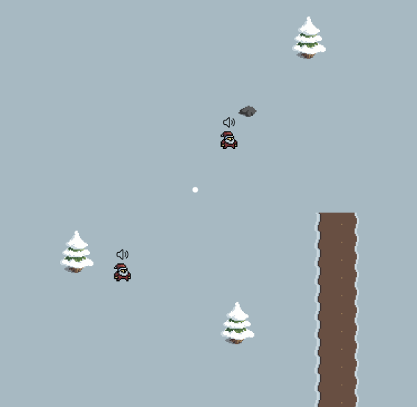

# SnowballGame
 

Javascript Node and React project that allows users to connect to the server hosted on Railway and play a multiplayer snowball game that teleports the user to a random spawn point after being hit with a snowball. The user can click around their screen to select where they wish to throw the snowball and use their arrow keys to move.
The server accomplishes hosting this service by tracking each player by their port and allowing each port to send an input before updating the server for everyone else on the server giving the user 60 frames to provide an input before updating.
# SnowballGame

# Some Features Include:

Obstacles: Obstacles cover the player while preventing the player from progressing through them.

Moving Map: Players are given a small area of the map to see and as they move the map will change around them creating a 2.5D simulation.

Connection Check: Automatically removes any players that have disconnected from the server
